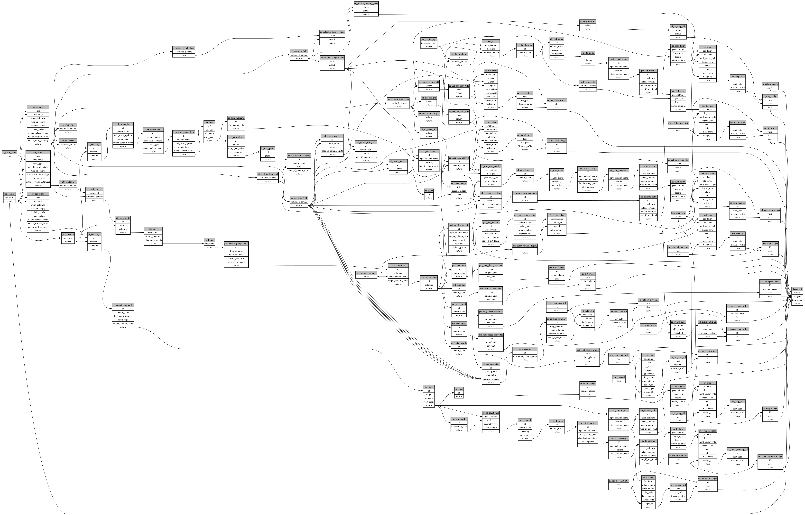

```
# AUTOGENERATED BY ECOSCOPE-WORKFLOWS; see fingerprint in README.md for details

```

```yaml
# fingerprint:
artifacts_sha256_basic: e80d756130c58139004ad494f5bdc011a6b9a3b3ad2c5a86bb32e512f88c64d5
artifacts_sha256_strict: 68ca81cb1d826ebb1e59240795ecadc16c437cace9db650117891eee5b941304
installed_requirements:
- channel: https://repo.prefix.dev/ecoscope-workflows/
  name: ecoscope-platform
  version: {version: ==2.15.1}
- channel: conda-forge
  name: pydeck
  version: {version: ==0.9.2}
- channel: https://repo.prefix.dev/ecoscope-workflows-custom/
  name: ecoscope-workflows-ext-wd
  version: {version: ==0.0.2}
params_sha256: 8ee314421d5275bef00929ffad58ca09e96f66f4bc2e639eaeb8ccf4d13b5593
spec_sha256: 2acd28767389aec682af607cbdebed1f44fc03bddaf8e4b3bcdccf344c61922c

```

# ecoscope-workflows-ops-dashboard-workflow


